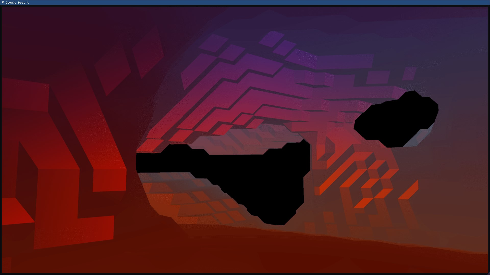

# Marching Cubes

Implementation of marching cubes algorithm in C++ .

## About
* Vertex coordinates and face normals generated on the GPU using a compute shader.
* Simplex noise at each point used as density function.
* For smooth (Gouraud) shading, vertices are indexed and the vertex normals are calculated on the CPU.

## How To Run This On Windows
* Clone the repository including the submodules using : 
```properties
git clone --recurse-submodules https://github.com/The-curs0r/marching-cubes.git
```
* Go into the cloned repository and run CMake : 
```properties
cd marching-cubes
cmake CMakeLists.txt -B ./build/ -G "Visual Studio 16 2019"
cd build
start marchingCubes.sln
```
* Build the solution for Release configuration
* Copy the shader files to the Release folder and run the application :   
```properties
copy *.glsl ./Release/
cd Release
start .\marchingCubes.exe
```

## How To Run This On Linux
* Clone the repository including the submodules using : 
```properties
git clone --recurse-submodules https://github.com/The-curs0r/marching-cubes.git
```
* Go into the cloned repository and run CMake : 
```properties
cd marching-cubes
cmake CMakeLists.txt -B ./build/ -G "Unix Makefiles"
cd build
make all
./marchingCubes 
```

## Bug/Feature Request
If you find a bug, or are unable to build the project or run the application, let me know through an issue [here](https://github.com/The-curs0r/marching-cubes/issues/new?assignees=&labels=&template=bug_report.md&title=).

If you have any ideas or suggestions for this project, please put them [here](https://github.com/The-curs0r/marching-cubes/issues/new?assignees=&labels=&template=feature_request.md&title=).

## Screenshots 

